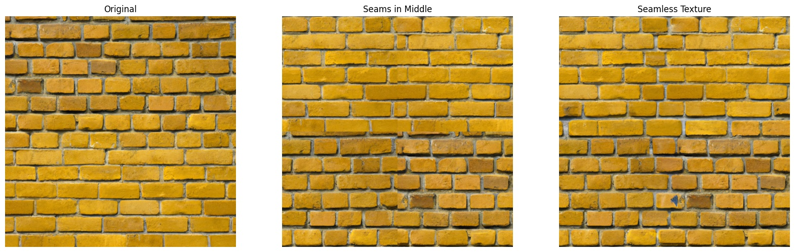

# Seamless-Texture-Generation-with-DALL-E-2

Generate Seamless textures from DALL-E-2 for novel textures for use in 3D modelling for the metaverse, art, or maybe procedural generation.

The project is preented as an ipython notebook. Example outputs:

